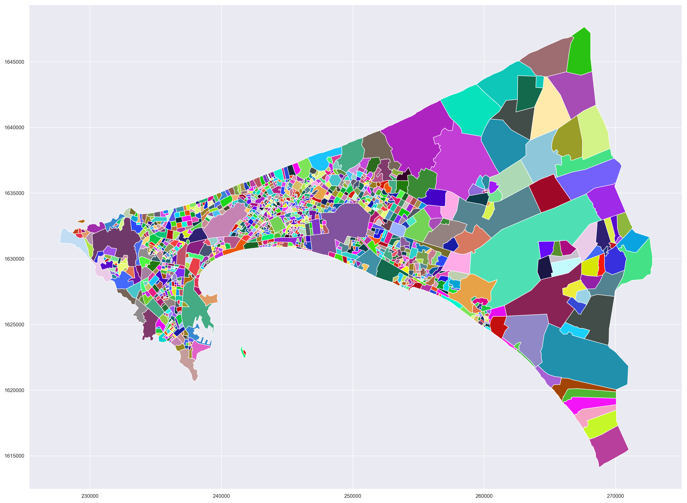
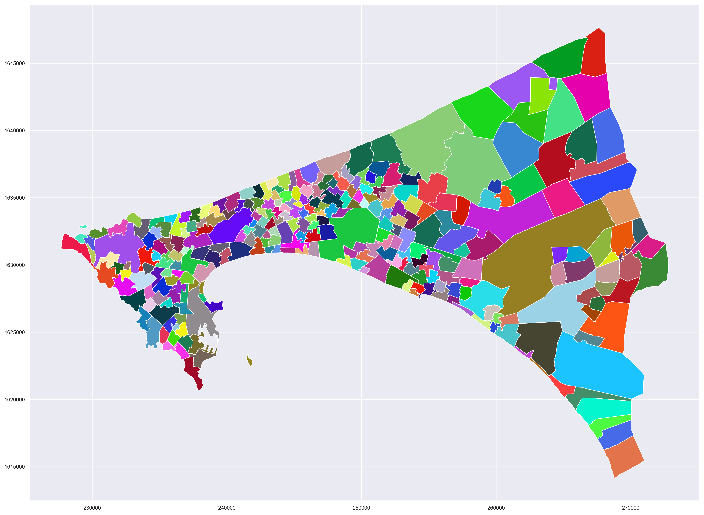
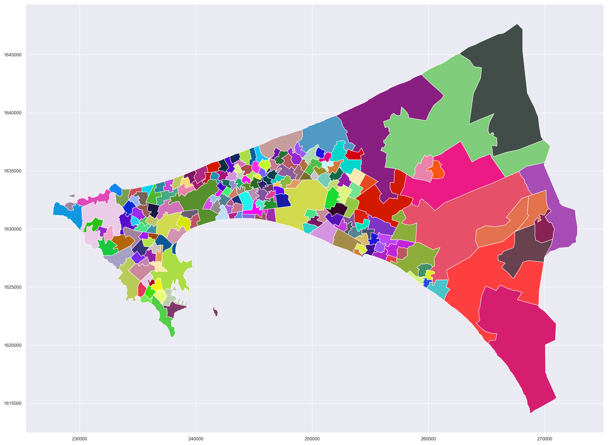

# Spatial k-means to aggregate polygons

The proposed Python code allows to use the [K-means clustering](https://en.wikipedia.org/wiki/K-means_clustering) to aggregate neighboring administrative units together. 

The user has to provide one polygon shapefile as input with an attribute table containing the population count for each administrative units. If the aim is just to aggregate polygons without aggregating any value coming from the attribute table, it should be possible for the user to adapt the code easily.

The code is provided in a Jupyter notebook that allow to run it step by step, giving more ease to the user for adapting to its own data.

## Illustrations
**Original administrative unit (admin1)**

**First result from K-means clustering**

**Final results - Admin 0**

## Brief explanation of the different steps
1. Extract X/Y coordinates of the polygons' centroid  and perform a K-means clustering on these data. The user can set for the desired number of clusters.
2. The initial polygons are merged (dissolving union) according to the results of the k-means clustering (cluster membership). Then, a check is made to ensure that the previous step has not created multi-part polygon (disjoint).
3. The use of k-means could result in newly created polygons that are exactly the same as a single original unit (there could have only one initial member in the resulting cluster). For that reason, a final step allows the user to define a minimum number of original units that should be included in the final polygons. 
In step 3, the "best" candidate for merging at this step is the neighboring cluster that is compounded by the lowest number of initial units. The rationale behind is to try to have more homogeneous cluster in terms of the number of initial units. Merging with neighboring cluster that share the longest border doesn't plaid in favor if reaching the minimum number of initial units desired and avoiding at the same time to generate very large-sized polygons.

## Dependencies
This code mainly relies on [GeoPandas](http://geopandas.org/) and [Scikitlearn](http://scikit-learn.org/stable/modules/generated/sklearn.cluster.KMeans.html).

- [pandas](https://pandas.pydata.org/)
- [geopandas](http://geopandas.org/)
- [matplotlib](https://matplotlib.org/)
- [numpy](http://www.numpy.org/)
- [seaborn](https://seaborn.pydata.org/)
- [sklearn](http://scikit-learn.org/)

## Potential improvements
The code could be improved with the following :

- Add an alternative clustering such as [DBSCAN](https://en.wikipedia.org/wiki/DBSCAN) also available in scikitlearn [sklearn.cluster.DBSCAN](http://scikit-learn.org/stable/modules/generated/sklearn.cluster.DBSCAN.html). 
 - Allow a possibility to avoid two initial units touching on a single node to be part of the same cluster in the final output (causing self-intersecting polygons). 
  - Add an extra possibility for the user to choose the neighboring cluster sharing the longest border as the 'best' candidate for merging too small cluster. 